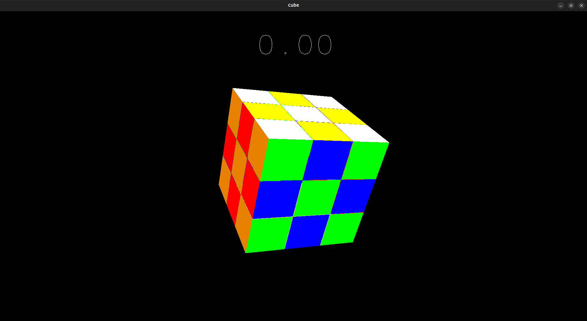

# PPC - semestrální práce

## Téma: 
Grafická hra – rubikova kostka 3x3

## Návod:
Po spuštění aplikace se zobrazí okno s vykreslenou rubikovou kostkou a vynulovanou časomíru nad kostkou. 

Kostku lze uvést do zamíchaného stavu stisknutím klávesy “F”, případně vrátit do složeného stavu stisknutím klávesy “R”, vracení kostky do původního stavu taktéž vynuluje časomíru.

Časomíra se spouští automaticky při prvním pohybu kostky po zamíchání (klavesou “F”), zastaví se taky automaticky ve chvíli kdy bude kostka složená.
 
Ovládání kostky je popsano v níže uvedené tabulce, stisknutí klávesy je přiřazeno k odpovídajícímu pohybu podle WCA notace. WCA notace je popsana například zde: [Meep.](https://meep.cubing.net/wcanotation.html)

|Klávesa|WCA notace|
|:-----:|:--------:|
|D      |R         |  
|SHIFT + D|R’|
|A|L|
|SHIFT + A|L’|
|W|U|
|SHIFT + W|U’|
|S|D|
|SHIFT + S|D’|
|Q|F|
|SHIFT + Q|F’|
|E|B|
|SHIFT + E|B’|
|L|y’|
|J|y|
|I|x|
|K|x’|
|O|z|
|U|z’|

### Aplikace by měla vypadat takto:

